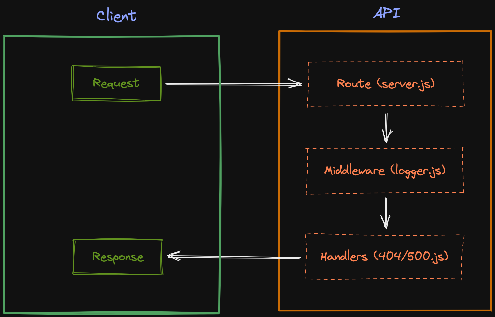

# Lab - Class 01

## Project: Server Deployment Practice

### Author: Julian Barker

### Problem Domain  

This repo is a review and slight build on creating and deploying an Express server. It outlines basic testing, error handling, and middleware.

### Links and Resources

- [ci/cd](https://github.com/julian-barker/server-deployment-practice/actions)
- [deployment](https://four01-server-deployment-practice.onrender.com/)

### Setup

#### `.env` requirements (where applicable)

- `PORT` - 3001

#### How to initialize/run your application (where applicable)

- nodemon

#### Features / Routes

- GET : `/` - return "It lives"
- GET : `/bad` - 500 error
- GET : `*` - 404 error

#### Tests

- npm test

#### UML

